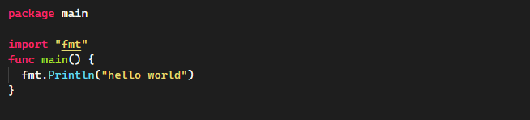
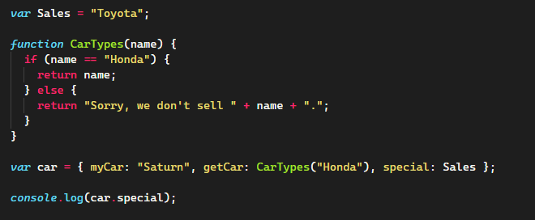
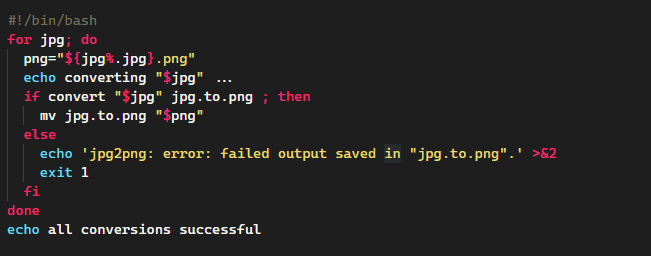

# Monokai Prime

A theme for VS Code that merges Dark+ with Monokai syntax highlighting.

## Screenshots

### Go

### JavaScript

### Markdown

### Shell

Testing using code examples from [atom/language-examples](https://github.com/atom/language-examples)
